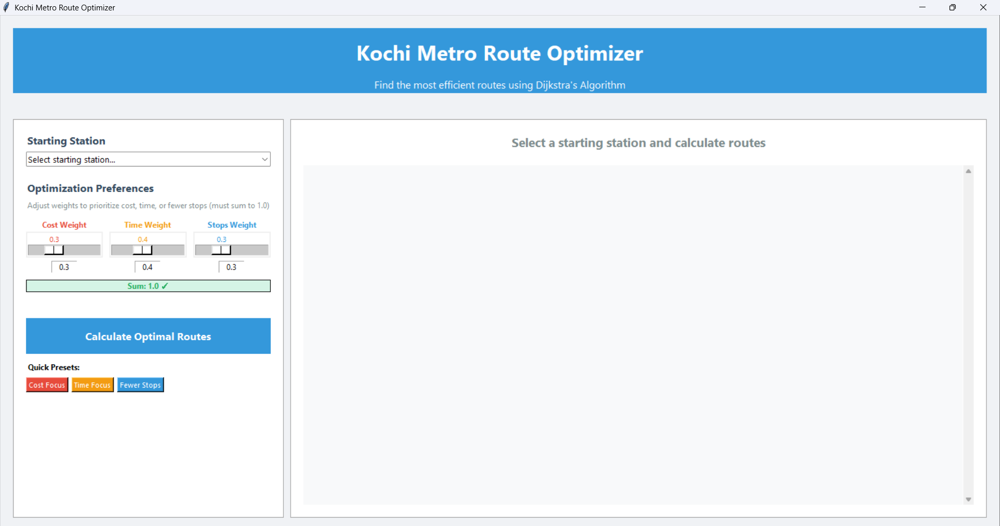
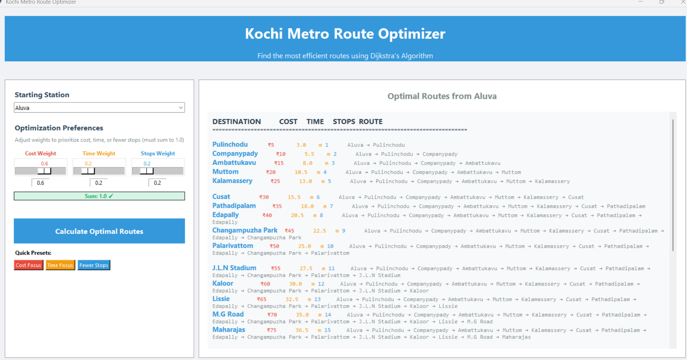

# Kochi Metro Route Optimizer 🚇

A Python-based route optimization system for Kochi Metro using **Dijkstra's Algorithm** with multi-criteria optimization. Find the most efficient routes considering cost, travel time, and number of stops.


## 🌟 Features

- **Multi-criteria Optimization**: Balance between cost, time, and number of stops
- **Complete Network Coverage**: All Kochi Metro Blue Line stations (23 stations)
- **Interactive GUI**: User-friendly tkinter interface with real-time validation
- **Flexible Weighting**: Customize optimization preferences with adjustable weights
- **Comprehensive Results**: View optimal routes to all destinations from any starting point
- **Real-time Calculations**: Fast route computation using optimized Dijkstra's algorithm

## 🚀 Quick Start

### Prerequisites
- Python 3.7 or higher
- tkinter (usually comes with Python installation)

### Installation

1. **Clone the repository**
   ```bash
   git clone https://github.com/yourusername/kochi-metro-optimizer.git
   cd kochi-metro-optimizer
   ```

2. **Install dependencies** (if any additional packages are needed)
   ```bash
   pip install -r requirements.txt
   ```

3. **Run the application**
   ```bash
   # For GUI version
   python metro_gui.py
   
   # For command-line version
   python dijkstra.py
   ```

## 🖥️ Usage

### GUI Application

1. **Select Starting Station**: Choose your departure station from the dropdown
2. **Set Optimization Preferences**: 
   - Adjust weights for Cost, Time, and Stops (must sum to 1.0)
   - Use quick presets for common preferences
3. **Calculate Routes**: Click "Calculate Optimal Routes" button
4. **View Results**: See optimal routes to all destinations sorted by efficiency





### Command Line Interface

```python
from dijkstra import KochiMetroNetwork, MetroRouteOptimizer

# Initialize the system
network = KochiMetroNetwork()
optimizer = MetroRouteOptimizer(network)

# Find optimal routes
routes = optimizer.find_optimal_routes(
    start_station="M.G Road",
    cost_weight=0.3,
    time_weight=0.4, 
    stops_weight=0.3
)

# Display results
for destination, route_info in routes.items():
    print(f"{destination}: ₹{route_info['total_cost']} | {route_info['total_time']}min | {route_info['total_stops']} stops")
```

## 🗺️ Kochi Metro Network

The system includes all 23 stations on the Kochi Metro Blue Line:

**Stations**: Aluva → Pulinchodu → Companypady → Ambattukavu → Muttom → Kalamassery → Cusat → Pathadipalam → Edapally → Changampuzha Park → Palarivattom → J.L.N Stadium → Kaloor → Lissie → M.G Road → Maharajas → Ernakulam South → Kadavanthra → Elamkulam → Vyttila → Thaikoodam → Petta → Thripunithura

## 🧮 Algorithm Details

### Dijkstra's Algorithm Implementation

The system uses a modified Dijkstra's algorithm with multi-criteria optimization:

```python
composite_distance = (cost_weight * normalized_cost + 
                     time_weight * normalized_time + 
                     stops_weight * normalized_stops)
```

### Optimization Factors

- **Cost**: Fare between stations (₹5 per station hop)
- **Travel Time**: Realistic time estimates based on station characteristics
- **Number of Stops**: Direct measure of journey complexity

### Network Representation

- **Nodes**: Metro stations
- **Edges**: Bidirectional connections with weighted attributes
- **Graph Structure**: Adjacency list representation for efficient traversal

## 📁 Project Structure

```
kochi-metro-optimizer/
├── dijkstra.py           # Core algorithm and network implementation
├── metro_gui.py          # Tkinter GUI interface
├── templates/            
│   └── index.html
├── app.py                # web-based GUI using Flask
├── requirements.txt      # Python dependencies
├── README.md             # Project documentation
├── screenshots/          # GUI screenshots
│   ├── gui_interface.png 
|   ├── path_finder.png

```

## 🔧 Technical Specifications

- **Language**: Python 3.7+
- **GUI Framework**: tkinter
- **Algorithm**: Modified Dijkstra's Algorithm
- **Data Structure**: Graph (Adjacency List)
- **Time Complexity**: O((V + E) log V) where V = stations, E = connections
- **Space Complexity**: O(V + E)

## 🎯 Use Cases

- **Commuter Planning**: Find most cost-effective or fastest routes
- **Tourist Navigation**: Optimize travel based on preferences
- **Transit Analysis**: Study metro network efficiency
- **Educational**: Demonstrate graph algorithms in real-world applications

## 🤝 Contributing

Contributions are welcome! Here's how you can help:

1. **Fork the repository**
2. **Create a feature branch** (`git checkout -b feature/AmazingFeature`)
3. **Commit your changes** (`git commit -m 'Add some AmazingFeature'`)
4. **Push to the branch** (`git push origin feature/AmazingFeature`)
5. **Open a Pull Request**

### Development Setup

```bash
# Clone your fork
git clone https://github.com/Amrutha-M05/kochi-metro-optimizer.git

# Create virtual environment
python -m venv venv
source venv/bin/activate  # On Windows: venv\Scripts\activate

# Install development dependencies
pip install -r requirements-dev.txt

# Run tests
python -m pytest tests/
```

## 🙏 Acknowledgments

- Kochi Metro Rail Limited for network information
- Python community for excellent libraries
- Contributors and users of this project

## 📈 Project Stats


---


Made with ❤️ for the Kochi Metro community
